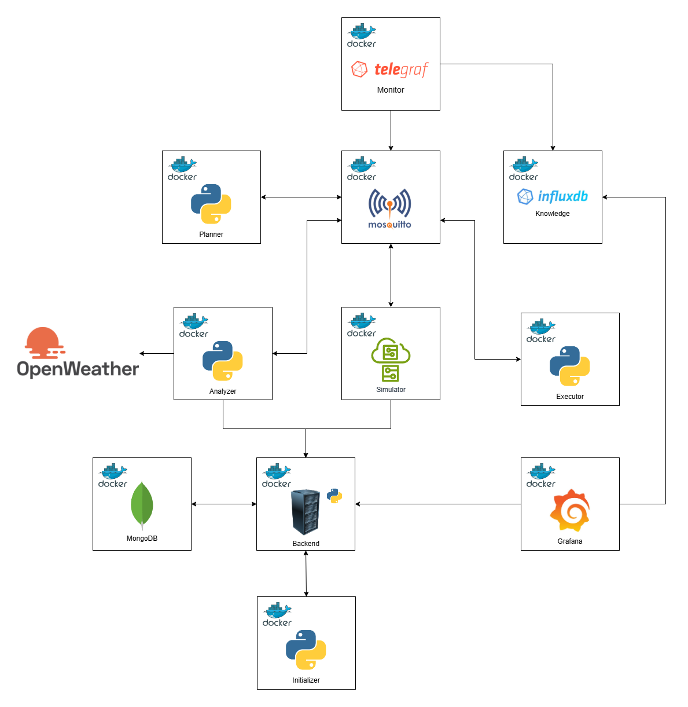
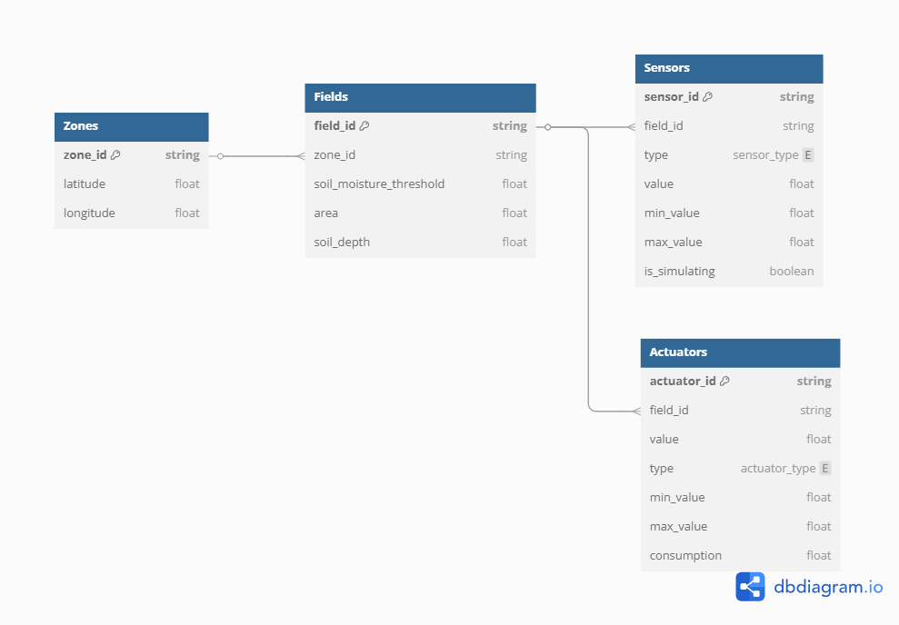

# Smart Irrigation System

## Introduction

This project is a smart irrigation system that uses sensors to monitor the soil moisture of the soil and actuators to water the plants when needed.

## Features

- Monitor the soil moisture of the soil
- Water the plants when the soil moisture is below a certain threshold
- Set the minimum and maximum soil moisture of the soil
- Monitor water consumption

## Hardware

The sensors and actuators used in this project are simulated using python. The sensors and actuators are the following:

- Light sensor *(simulated)*
- Humidity sensor *(simulated)*
- Temperature sensor *(simulated)*
- Soil moisture sensor *(simulated)*

## Software

- Python
- Flask
- Docker
- Mosquitto
- MongoDB
- Grafana
- InfluxDB
- Telegraf
- OpenWeatherMap API
- Paho MQTT

## Architecture

The architecture of the system is the following:

### Sensors

These are crucial for **monitoring** and gathering real-time data about environmental conditions. The
main sensors are:

- Soil moisture sensor
- Light sensor
- Temperature sensor
- Humidity sensor

### Actuators

The irrigation devices are the physical components that deliver water to the plants. The executor
instructs them when to start or stop watering.
Examples of irrigation devices:

- Sprinklers
- Drip irrigation lines

### Monitor

The monitor receives data from sensors and actuators and stores it on the knowledge.

### Analyzer

The analyzer is a python application that receives messages from the sensors and actuators via MQTT
and sends. It analyzes the data considering the system settings, the current values of the sensors and
the weather conditions of the zone, the output is then sent to the Planner via MQTT.

### Planner

The Planner is a python application that runs on a container. It receives from the analysis performed by
the Analyzer; it applies a policy and then sends it to the Executor.

### Executor

The executor is a python application running on a container. It receives commands from the Planner
and sends them to the actuators.

### Simulator

The Simulator is a python application running on a container. It gets the system settings from the
Backend and starts the simulation. It simulates the sensors and actuators.

### Mosquitto

Mosquitto is used to create the MQTT broker for the system.

### MongoDB

MongoDB is used to store the system information such as zones, fields, sensors, actuators and
settings.

### Initializer

The initializer is a python application running on a container. It follows the init container pattern. Its
function is to populate the system configuration if it has not been loaded yet.

### Grafana

Grafana is used to monitor the zones, fields, sensor and actuators data. It also is used to update the
soil moisture threshold.

## Data model

## Adaptation Goals

| Goal                     | Description                                                                                       | Evaluation metric         |
|--------------------------|---------------------------------------------------------------------------------------------------|---------------------------|
| Trigger irrigation devices | Trigger irrigation devices when the soil moisture level drops below a certain threshold and rain is not predicted in the next X hours (adjustable by the user). | \( (SmL \leq Smt) \, \text{Λ} - Rp \) |
| Stop irrigation           | Stop irrigation when the soil moisture level has reached the soil moisture threshold or rain is predicted in the next X hours (adjustable by the user) to avoid overwatering. | \( (SmL > Smt) \, \text{V} \, Rp \) |

- \( SmL \) = Soil moisture level
- \( Smt \) = Soil moisture threshold
- Rp = rain prediction

## Requirements

- [Docker](https://www.docker.com/get-started/)

## Configuration

- **Influxdb**:
  - Username: `admin`
  - Password: `adminadmin`
  - Url: <http://localhost:8086>
- **Grafana**:
  - Username: `admin`
  - Password: `admin`
  - Url: <http://localhost:3000>
- **Mosquitto**:
  - Local port: `1882` and `9002`

## Installation

- Clone the repository `git clone <https://github.com/BryantSarabia/SE4AS.git>`
- Run `docker-compose up`
- Open the web browser and go to <http://localhost:3000>

## Authors

- Bryant Michelle Sarabia Ortega
